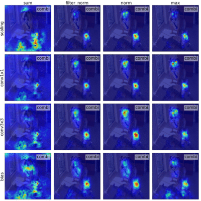

## There and Back Again: Revisiting Backpropagation Saliency Methods

Standalone code for the paper: There and Back Again: Revisiting Backpropagation Saliency Methods, CVPR 2020 by [Sylvestre-Alvise Rebuffi*](http://www.robots.ox.ac.uk/~srebuffi/), [Ruth Fong*](http://ruthcfong.github.io/), [Xu Ji*](https://github.com/xu-ji) and [Andrea Vedaldi](http://www.robots.ox.ac.uk/~vedaldi/)

For better analysis tools and to perform the benchmarks on Pascal or COCO, we recommend to use [TorchRay](https://github.com/ruthcfong/TorchRay/tree/normgrad) where all the saliency methods of the paper are implemented.

<p align="center">
  <br>
  <b>Combinations of phase 1 (rows) and phase 2 (columns) for VGG16 at different layers ("combi" is when combining layers)</b><br>
</p>

## Code
To get the saliency maps used in the above figure, simply run the following PyTorch code:
```
python vgg16_grid_saliency.py
```
The other python file produces the same grid but for ResNet50.

## Cite this work
If you use this code for your project please consider citing us:
```
@inproceedings{rebuffi2020saliency,
  title={There and Back Again: Revisiting Backpropagation Saliency Methods},
  author={Rebuffi, Sylvestre-Alvise and Fong, Ruth and Ji, Xu and Vedaldi, Andrea},
  booktitle={Conference on Computer Vision and Pattern Recognition (CVPR)},
  year={2020}
}
```

## Acknowledgments
This work is supported by Mathworks/DTA DFR02620, the Rhodes Trust (M.P.), EPSRC AIMS CDT and ERC 638009-IDIU.

The standalone code in this repository is inspired by https://github.com/jacobgil/pytorch-grad-cam
